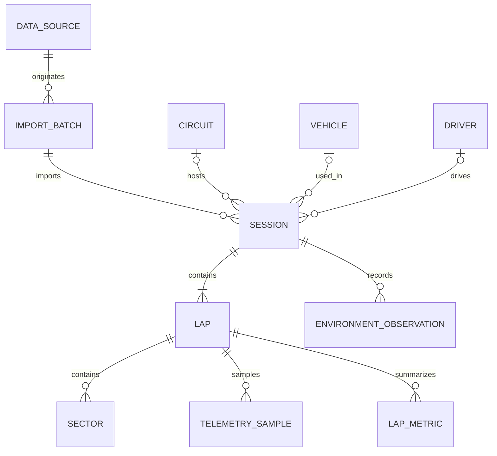

# Modelo lógico inicial de telemetría

Esta propuesta es un punto de partida verificable, no un esquema físico cerrado. La inspección ya muestra tres granularidades (muestras, vueltas agregadas y metadata de sesión) y señales específicas de cada fuente. Se mantendrá pequeño hasta completar el perfilado.

## Entidades y relaciones

Una sesión pertenece a una importación y puede asociarse a piloto, vehículo y circuito cuando la fuente los identifique. Una vuelta contiene cero o más muestras y sectores; la disponibilidad de cada relación depende del origen. No se exige crear entidades maestras completas para nombres externos que solo aparecen como etiquetas en una sesión.

## Campos propuestos

### DataSource e ImportBatch

- Fuente/formato y versión de adaptador.
- Identificador externo de sesión/vuelta (por ejemplo, `dataKey` de F1).
- Ruta/nombre lógico del archivo, hash, fecha de importación y conteos de registros aceptados/rechazados.
- Errores y advertencias de validación.
- Evitar guardar payloads completos por defecto; mantener trazabilidad al origen y muestras controladas para pruebas.

### Session

- Identificador interno; tipo (práctica, clasificación, carrera, simulación o desconocido); inicio si está disponible.
- Referencias opcionales a circuito, vehículo y piloto; proveedor y metadata externa.
- Metadata de contexto (p. ej., clima/condiciones) solo cuando exista y con su procedencia.

### Lap y Sector

- Número/identificador externo, tiempo de vuelta y estado (válida, inválida o desconocido).
- Compuesto, stint y combustible/setup solo cuando la fuente lo aporte.
- Sectores con índice, tiempo y referencias disponibles. No inferir fronteras de sector desde muestras si no existen reglas fiables para la fuente.

### TelemetrySample (el punto canónico)

- Clave de vuelta + índice de orden estable.
- `elapsedTime` relativo a la vuelta o sesión, conservando la referencia temporal.
- `distance` (unidad normalizada: metros), si está disponible.
- Canales comunes opcionales: speed (m/s interno; conversión explícita al importar), engine RPM, gear, throttle y brake normalizados a [0,1] cuando la fuente permita esa conversión.
- Posición cartesiana opcional `positionX/Y/Z` con sistema de referencia documentado; coordenadas geográficas se modelarían aparte, solo si realmente existen.
- Aceleración longitudinal/lateral/vertical opcional, con ejes, unidad y signo documentados.
- Orden, tiempo y canales comunes no se asumen presentes ni sincronizados en todas las fuentes.

### ChannelDefinition y SampleChannelValue

Para conservar canales de alta frecuencia/específicos sin tener que añadir columnas nullable continuamente:

- Definición por nombre canónico, unidad, tipo numérico/booleano/categórico, ejes/posición (p. ej. neumático FL), descripción y regla de conversión.
- Valor opcional por muestra, asociado a esa definición; ausencia significa dato no observado.
- Canales potenciales: tyre temperature/pressure/wear por rueda, steering, lean angle, freno delantero/trasero, velocidades de rueda, suspensión, slip, DRS y señales IMU.
- En la muestra F1, `throttle` está en escala 0–100 y `brake` en 0–1; las conversiones deben definirse de forma independiente por canal y adaptador.
- El mecanismo físico (columnas especializadas, tabla de valores o almacenamiento analítico separado) queda pendiente de volumen/rendimiento y no se decide en esta fase.

### TelemetryAggregate

Las fuentes como el CSV de ACC que ya contienen una fila de métricas por vuelta se representarán como agregados/features de vuelta, no como muestras sintéticas. Se preservan nombre/unidad/procedencia de cada métrica y el nivel de granularidad.

## Principios de normalización

1. Normalizar unidades a convenciones explícitas al cruzar al modelo interno, conservando el valor/unidad de origen en el proceso de importación cuando sea útil para auditoría.
2. Guardar valores desconocidos como nulos y distinguirlos de cero, `false`, “no aplicable” o “no medido”.
3. Los adaptadores interpretan esquemas externos; el núcleo de analítica consume el modelo canónico y descripciones de canal.
4. Permitir campos de fuente en metadata acotada para no perder identificadores, sin propagar su esquema externo a la lógica de dominio.
5. El LLM recibirá métricas y hallazgos validados, nunca arrays crudos de telemetría.

## Aspectos por validar antes del esquema físico

- Si `time` F1 es relativo al inicio de vuelta y `distance` es monótono/uniforme; significado de `rel_distance` y del eje X/Y/Z.
- Cobertura real y unidades de cada canal por fuente; definición de aceleraciones y convenciones de signos.
- Si `lap_progress` de Assetto Corsa es suficiente para delimitar vueltas y los identificadores de Forza/Kawasaki permiten reconstruir sesiones.
- El CSV ACC examinado solo tiene agregados y etiquetas de cluster sin procedencia documentada; no tratarlo como series temporales ni usar esas etiquetas como verdad de terreno por ahora.
- Alineación temporal de registros ECU e IMU de la moto y tratamiento de canales dispersos.
- Tamaño esperado, consultas principales y estrategia de persistencia de muestras/valores de canal.
- Requisitos de comparación: misma vuelta/coche/circuito/condiciones o normalización explícita entre sesiones.
